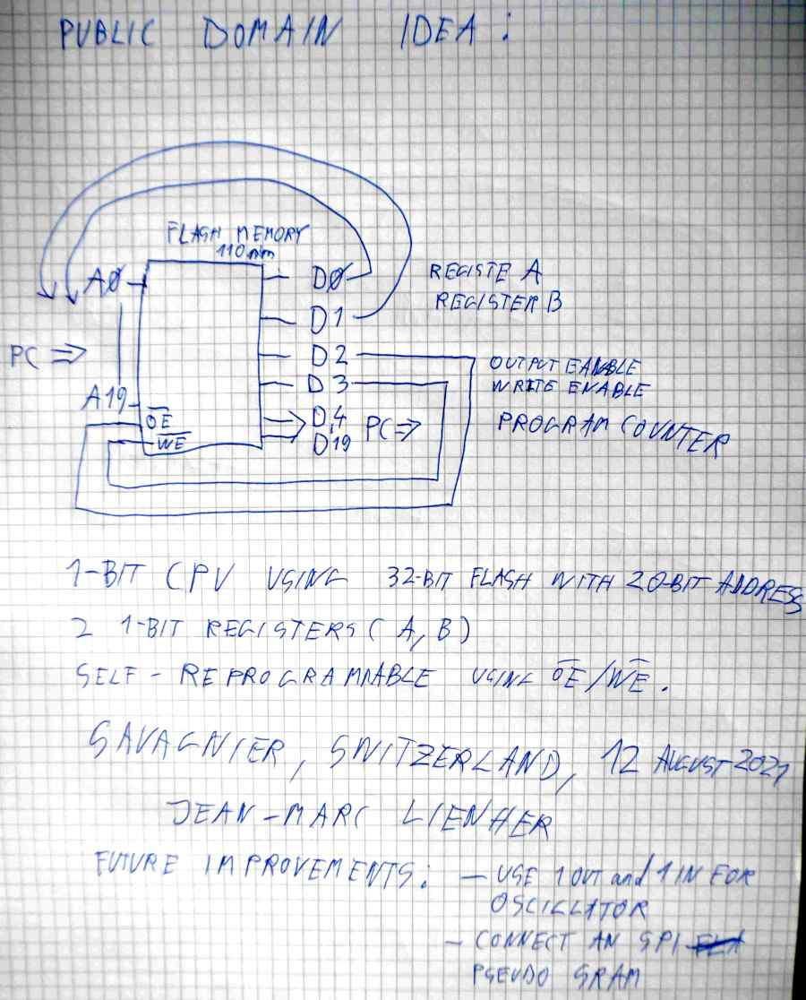

# logical16x16
Hardware Description Language for EPROM and FLASH memories

```
sudo apt install build-essential git curl libtinfo5 iverilog 
./build.cmd
```

## Ternary logic computer... 




## Some links

https://homepage.cs.uiowa.edu/~jones/ternary/

https://www.youtube.com/watch?v=J94FavGqvCQ

https://bailleux.net/pub/ob-project-gray1.pdf

https://www.youtube.com/watch?v=J-pyCxMg-xg


